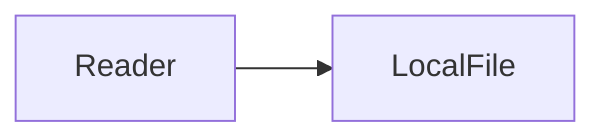

# AI Markdown Corpus

## Checklist

- [x] Tables render
- [ ] Footnotes remain readable[^source]

| Feature | Status |
| --- | --- |
| KaTeX | `$x^2$` |
| Mermaid | bounded |

> [!TIP]
> Keep the document local by default.

[^source]: Versioned test fixture.
